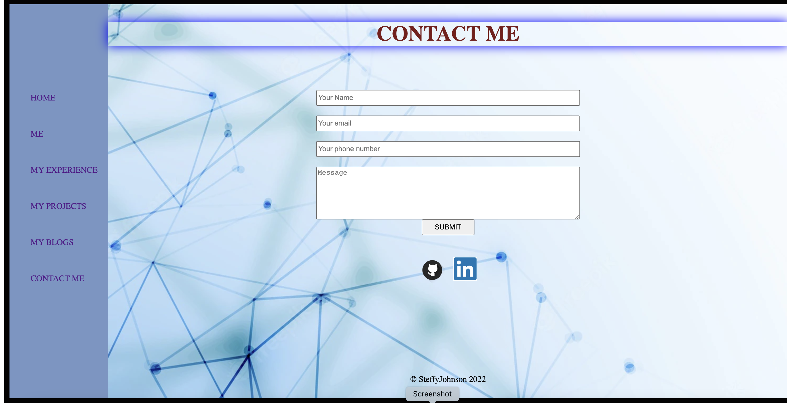

# T1A2 - Portfolio

[Netlify Link]()
    
[github repo](https://github.com/Steff4evr/portfolio)

[Youtube link] ()

## PURPOSE
The purpose of this website is to showcase my skills as an aspiring web developer and an IT professional that portrays my professional knowledge, my experience and my projects along with my interests.

## FUNCTIONALITY/FEATURES
This portfolio is designed to be simple and eye catching, but easy to navigate, all while capturing a glimpse of my personality through bright colour choices.

### Home: 
Contains an image of myself, my name, email address and phone number. This also contains a link to my github and likedin  profiles.
There's a navigation bar present on the left side to other pages.

### ME: 
This page consists a note on myself,my previos job history and my interests along with few images of it with hovering and transition animation. There's a navigation bar present on the left side to other pages.

### MY EXPERIENCE: 
This page consists of my employment history along with two pictures each with a hovering animation. I have attached my resume PDF link at the bottom of the page. I have also created  a 'Back to top' function for navigation ease.There's a navigation bar present on the left side to other pages.

### MY PROJECTS: 
Contain three pictures on the top under the header. This page consists of three projects portrayed in three different boxes with box shadow.There's a navigation bar present on the left side to other pages.
  

### MY BLOGS: 
This page contains five blogs of mine in five different pages with background images and dates published. Slides are used to navigate to other pages. An animation is also present while navigating to other pages. There's a 'Read more' button on each page. There's a navigation bar present on the left side to other pages.

### CONTACT ME: 
This page is to conact me and there's a contact form present. Links to my github and linkedin profiles are also available.There's a navigation bar present on the left side to other pages.

## SITEMAP

Each page links together with a navbar at the top. 5 blog posts are accessible from the blog page.

## SCREENSHOTS

### Home

### Contact me

### Resume PDF Link

## TARGET AUDIENCE
The target audience for my portfolio website is for prospective employers having an expectation on my technical knowledge relating to IT, software development or coding and development stacks. This site is also responsive for mobile, tablet and desktop to allow for a multi use audience.

## Tech Stack
This portfolio is designed with HTML, CSS and Java script. Site wll be refreshed and updated when I learn more. 

Hosted on Netlify.